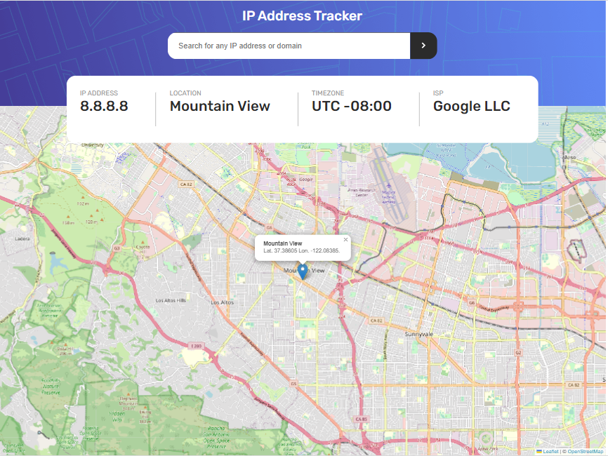

# Frontend Mentor - IP address tracker solution

This is my solution to the [IP address tracker challenge on Frontend Mentor](https://www.frontendmentor.io/challenges/ip-address-tracker-I8-0yYAH0). Frontend Mentor challenges help you improve your coding skills by building realistic projects.

Built with HTML, CSS, Leaflet.js, and Express.js server for proxy and rate limit of https://geo.ipify.org API

If the map does not load it is because API is rate limited by the Express Proxy to 5 requests per 15 minutes so that limited API credits aren't used up too quickly.

## Table of contents

- [Overview](#overview)
  - [The challenge](#the-challenge)
  - [Screenshot](#screenshot)
  - [Links](#links)
- [My process](#my-process)
  - [Built with](#built-with)
  - [What I learned](#what-i-learned)
  - [Continued development](#continued-development)
      <!-- - [Useful resources](#useful-resources) -->
    <!-- - [Author](#author) -->
    <!-- - [Acknowledgments](#acknowledgments) -->

## Overview

### The challenge

Users should be able to:

- View the optimal layout for each page depending on their device's screen size
- See hover states for all interactive elements on the page
- See their own IP address on the map on the initial page load
- Search for any IP addresses or domains and see the key information and location

### Screenshot

### Links

<!-- - Solution URL: [Add solution URL here](https://your-solution-url.com) -->

- Live Site URL: [https://david-abell.github.io/ip-address-tracker/](https://david-abell.github.io/ip-address-tracker/)

## My process

### Built with

- Semantic HTML5 markup
- CSS custom properties
- Flexbox
- [Express](https://expressjs.com/) - Node.js Server framework api proxy
- Leaflet maps
- Geo-ipify location API

### What I learned

Use Typescript when building Express servers. Not having access to any method return types for `http-proxy-middleware` made route string conversion much more complicated than it needed to be.

### Continued development

The search input placeholder text is too large on mobile at least according to the design specs...

<!-- ### Useful resources -->

<!-- - [Example resource 1](https://www.example.com) - This helped me for XYZ reason. I really liked this pattern and will use it going forward.
- [Example resource 2](https://www.example.com) - This is an amazing article which helped me finally understand XYZ. I'd recommend it to anyone still learning this concept. -->

<!-- ## Author

- Website - 
- Frontend Mentor - [@yourusername](https://www.frontendmentor.io/profile/yourusername)

## Acknowledgments -->
